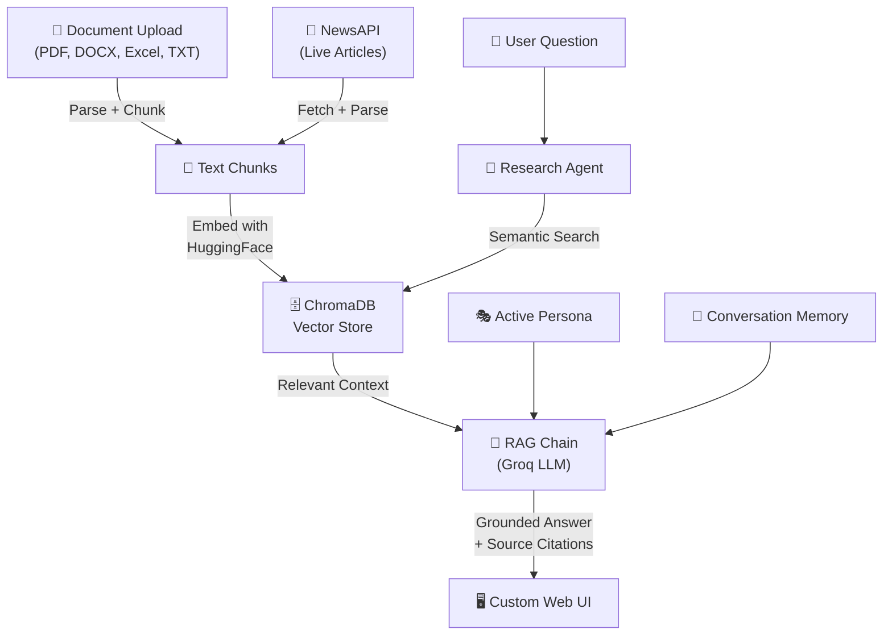

# 🧠 IntelliDigest — Multi-Source AI Research Assistant

A RAG-powered research assistant built with **LangChain**, **ChromaDB**, and **Groq (Llama 3.3)** that ingests documents, news articles, and more into a unified knowledge base, then lets you chat with it using persona-aware AI agents. Accounts are **per-user**: each signed-in user gets isolated document vectors, chat memory, and support tickets.

**Live demo:** [https://intellidigest.fly.dev/](https://intellidigest.fly.dev/)


## Features

- **Accounts & auth** : Email/password with **JWT**; optional **Google OAuth**; **forgot password** flow with time-limited reset tokens and **SMTP** (or compatible) email delivery
- **Per-user data** : Separate Chroma collections (`intellidigest_u_*`), per-user SQLite tickets, and conversation memory; shared **support FAQ** collection for the support agent only
- **Multi-format document ingestion** : Upload PDF, DOCX, Excel, and TXT files
- **Live news search** : Fetch and ingest articles via NewsAPI
- **RAG question answering** : Retrieval-Augmented Generation with source citations
- **Semantic search** : Find relevant content by meaning, not just keywords
- **5 persona modes** : Tone-adaptive responses (Tech, Business, Academic, Casual, Political)
- **Stuff & map-reduce chains** : Brief and detailed summarization
- **Conversation memory** : Rolling summary compression for multi-turn context
- **Research agent** : Prompt-based grounding over the **main** Chroma collection (uploads + news)
- **Support tab & ticketing** : LangChain `AgentExecutor` with tools; SQLite tickets; **dedicated support KB** (separate Chroma collection, curated `support/kb/*.md`) searched only by the support agent
- **Ticket lifecycle** : REST `PATCH` / `POST …/close`; close/edit/new-chat **confirmation modals** when the support agent invokes the UI affordance tools
- **Telegram via n8n** : Forward Chat/Support replies through a user-hosted n8n webhook (`POST /api/n8n/telegram`); optional Dockerized n8n in Compose
- **Groq + optional Ollama fallback** : If Groq rate-limits or errors, LLM calls can fall back to a local **Ollama** model (`OLLAMA_FALLBACK_MODEL`, default `qwen2.5:0.5b`)
- **Custom web UI** : Hand-crafted HTML/CSS/JS frontend aligned with [DESIGN.md](./DESIGN.md)
- **Optional Streamlit UI** : Legacy `app.py` interface for local experimentation

## Architecture

```
IntelliDigest/
├── server.py                       # FastAPI REST API (main app entry)
├── paths.py                        # INTELLIDIGEST_PERSIST_DIR — Chroma + SQLite root
├── auth/                           # JWT, users DB, Google OAuth, password reset + email
├── frontend/
│   ├── index.html                  # App shell (auth, Chat, News, Search, Support + tickets)
│   ├── styles.css                  # Custom design system (DESIGN.md tokens)
│   └── app.js                      # UI logic
├── agents/
│   └── research_agent.py           # Prompt-grounded “agent” over main KB
├── chains/
│   ├── llm_factory.py              # ChatGroq + ChatOllama (RunnableWithFallbacks)
│   ├── summarizer.py               # Stuff + map-reduce LangChain chains
│   └── qa_chain.py                 # RAG question-answering chain
├── support/                        # Support tab: tickets, classifier, support-only retriever, agent
│   ├── agent.py                    # AgentExecutor + UI affordance tools
│   ├── tickets.py                  # SQLite + create_ticket; REST update/close
│   ├── retriever.py                # search_support_knowledge_base → intellidigest_support only
│   ├── bootstrap_kb.py             # Ingest support/kb/*.md on first run
│   ├── prompts.py                  # IntelliDigest-grounded system prompt
│   ├── ui_tools.py                 # show_* confirmation triggers (no DB writes)
│   └── kb/                         # Curated markdown for the support vector collection
├── ingestion/
│   ├── document_loader.py          # PDF, DOCX, Excel, TXT parser + chunking
│   └── news_retriever.py           # NewsAPI client
├── memory/
│   └── conversation.py             # Chat history + summary compression
├── vectorstore/
│   └── engine.py                   # Chroma: per-user main + intellidigest_support
├── personas/
│   └── personas.py                 # 5 persona definitions
├── app.py                          # Optional Streamlit UI (not used by Docker/Fly default)
├── Dockerfile                      # Python 3.13-slim image for production
├── fly.toml                        # Fly.io app config (volume-backed persistence)
├── docker-compose.yml              # App only (default; production-friendly)
├── docker-compose.with-n8n.yml     # Optional: app + bundled n8n
├── docs/                           # Guides: ARCHITECTURE, Dockerless, running, production, n8n
├── tests/                          # pytest (auth edge cases, etc.)
├── n8n/                            # Sample Telegram workflow JSON
├── data/                           # tickets.db (gitignored) under persist dir at runtime
├── .env.example                    # API keys, JWT, OAuth, SMTP, Ollama, n8n
├── requirements.txt                # Python dependencies
└── README.md
```

### Data flow



### API endpoints

| Method | Endpoint | Description |
|--------|----------|-------------|
| `GET` | `/` | Serve the frontend |
| `GET` | `/health` | Liveness probe (`status: ok`) |
| `POST` | `/api/auth/register` | Register (email/password); returns JWT |
| `POST` | `/api/auth/login` | Login; returns JWT |
| `POST` | `/api/auth/forgot-password` | Request password reset email |
| `POST` | `/api/auth/reset-password` | Complete reset with token |
| `GET` | `/api/auth/config` | Public auth options (e.g. Google OAuth enabled) |
| `GET` | `/api/auth/google` | Start Google OAuth |
| `GET` | `/api/auth/google/callback` | Google OAuth callback |
| `GET` | `/api/personas` | List available personas |
| `GET` | `/api/stats` | Knowledge base statistics |
| `POST` | `/api/chat` | Send a message to the research flow (authenticated) |
| `POST` | `/api/upload` | Upload a document (main KB) |
| `POST` | `/api/news/search` | Search and ingest news (main KB) |
| `POST` | `/api/summarize` | Brief or detailed summarization |
| `GET` | `/api/search?q=...` | Semantic search over the **main** collection |
| `DELETE` | `/api/clear` | Clear the **main** knowledge base collection |
| `DELETE` | `/api/chat/clear` | Clear chat history |
| `GET` | `/api/chat/history` | Get chat history |
| `POST` | `/api/support/chat` | Support agent (`response`, `session_id`, optional `ticket_actions`) |
| `POST` | `/api/support/sessions/clear` | Clear support session memory + cached executor |
| `GET` | `/api/tickets` | List support tickets |
| `GET` | `/api/tickets/{id}` | Get one ticket |
| `PATCH` | `/api/tickets/{id}` | Update ticket fields |
| `POST` | `/api/tickets/{id}/close` | Close ticket (optional `resolution_note` body) |
| `POST` | `/api/n8n/telegram` | Forward verify/save payloads to n8n (Telegram workflow) |
| `POST` | `/api/n8n/webhook` | Ingest external content into the KB (n8n → Chroma) |
| `GET` | `/api/n8n/status` | Whether a default n8n webhook URL is configured |

### LangChain components

| Component | Usage |
|-----------|--------|
| `ChatGroq` | Primary LLM (Llama-class via Groq) for chat, RAG, summarizer, support |
| `ChatOllama` | Fallback when Groq errors (see `chains/llm_factory.py`, `.env.example`) |
| `RunnableWithFallbacks` | Wraps Groq → Ollama for rate limits / outages |
| `AgentExecutor` + `create_tool_calling_agent` | Support tab only (tools: support KB search, classify, `create_ticket`, UI affordances) |
| `ChatPromptTemplate` | Prompt engineering with persona injection |
| `HuggingFaceEmbeddings` | Local sentence-transformer embeddings |
| `Chroma` | Per-user main collections (`intellidigest_u_*`); shared `intellidigest_support` (curated support docs) |
| `StrOutputParser` | LCEL chain output parsing |
| LCEL chains | `prompt \| llm \| parser` composition |
| Stuff / map-reduce | Brief and detailed summarization |
| RAG pattern | Main QA chain retrieves from the main collection; support agent uses `search_support_knowledge_base` only |

## Quick start

**Run without Docker:** see **[docs/DOCKERLESS.md](./docs/DOCKERLESS.md)**.

**Docker (default — app only):** Chroma + SQLite under a writable directory (see `paths.py` / `INTELLIDIGEST_PERSIST_DIR`).

```bash
cp .env.example .env   # add GROQ_API_KEY, JWT_SECRET, etc.
docker compose up -d --build
```

Open `http://localhost:8000`, **register or log in**. Each account has its own document collection and support tickets; the support FAQ collection is shared.

**Docker with bundled n8n** (Telegram workflows in the same stack):

```bash
docker compose -f docker-compose.with-n8n.yml up -d --build
```

Then n8n is at `http://localhost:5678`. See [docs/n8n-telegram.md](./docs/n8n-telegram.md).

**Day-to-day usage, env reference, and API overview:** [docs/RUNNING_GUIDE.md](./docs/RUNNING_GUIDE.md).

**Production (Fly.io, HTTPS, CORS, backups, health checks):** [docs/PRODUCTION.md](./docs/PRODUCTION.md).

**Documentation index:** [docs/README.md](./docs/README.md). **Architecture & dataflow:** [docs/ARCHITECTURE.md](./docs/ARCHITECTURE.md).

## Deployment

- **Fly.io** — The app is deployed at [https://intellidigest.fly.dev/](https://intellidigest.fly.dev/) using [`fly.toml`](./fly.toml) and the root [`Dockerfile`](./Dockerfile). Persistent Chroma and SQLite live on a Fly volume; configure `INTELLIDIGEST_PERSIST_DIR` and secrets as described in [docs/PRODUCTION.md](./docs/PRODUCTION.md).
- **Any Docker host** — Same image as Fly; use `docker compose` with volume mounts for data.
- **VPS (e.g. Oracle Cloud, Hetzner)** — Typical Docker + reverse proxy + TLS setup; see [docs/PRODUCTION.md](./docs/PRODUCTION.md).

## Tests

```bash
pytest
```

## Tech stack

- **Python 3.13** (Docker image); 3.11+ supported for local runs per `requirements.txt`
- **LangChain** — Chains, `AgentExecutor`, prompts, memory
- **Groq** — Primary fast inference (Llama-class models)
- **Ollama** (optional) — Local fallback LLM when Groq is unavailable or rate-limited
- **ChromaDB** — Persistent vector database (per-user main vs shared support KB)
- **Hugging Face** — `all-MiniLM-L6-v2` sentence embeddings
- **SQLite** — Users and support tickets (under the persist directory)
- **FastAPI** — REST API
- **Vanilla HTML/CSS/JS** — Hand-crafted UI
- **NewsAPI** — Real-time news retrieval
- **n8n** (optional) — Webhook automation for Telegram forwarding
