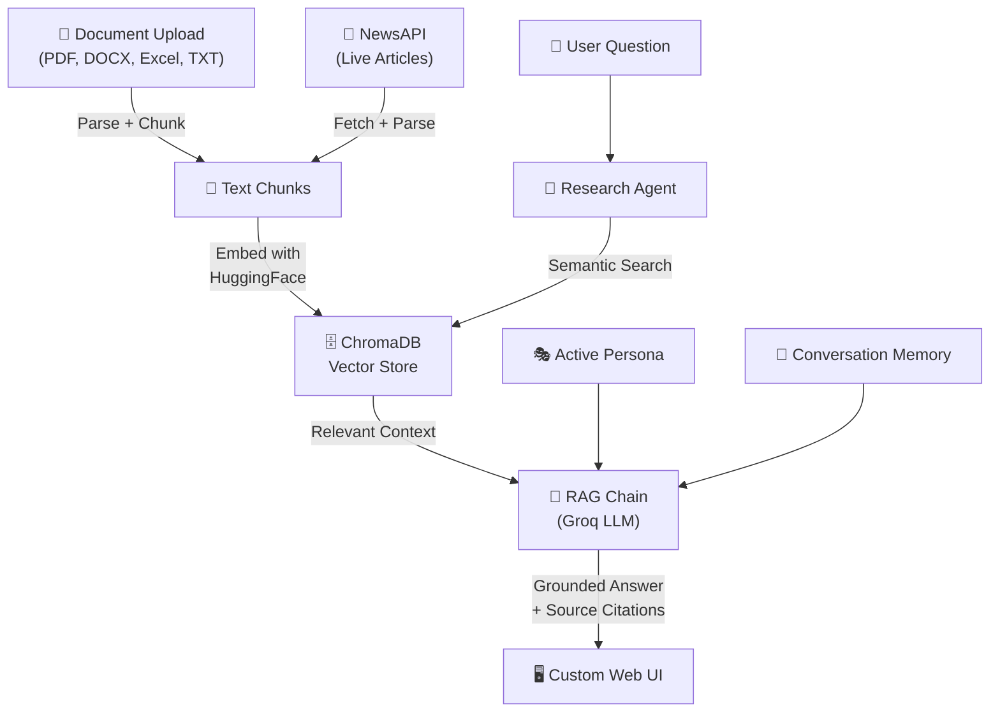

# 🧠 IntelliDigest — Multi-Source AI Research Assistant

A RAG-powered research assistant built with **LangChain**, **ChromaDB**, and **Groq (Llama 3.3)** that ingests documents, news articles, and more into a unified knowledge base, then lets you chat with it using persona-aware AI agents.


## Features

- **Multi-Format Document Ingestion** : Upload PDF, DOCX, Excel, and TXT files
- **Live News Search** : Fetch and ingest articles via NewsAPI
- **RAG Question Answering** : Retrieval-Augmented Generation with source citations
- **Semantic Search** : Find relevant content by meaning, not just keywords
- **5 Persona Modes** : Tone-adaptive responses (Tech, Business, Academic, Casual, Political)
- **Stuff & Map-Reduce Chains** : Brief and Detailed summarization
- **Conversation Memory** : Rolling summary compression for multi-turn context
- **Research Agent** : Prompt-based grounding over the **main** Chroma collection (uploads + news)
- **Support Tab & Ticketing** : LangChain `AgentExecutor` with tools; SQLite tickets (`data/tickets.db`); **dedicated support KB** (separate Chroma collection, curated `support/kb/*.md`) searched only by the support agent—not your uploaded docs
- **Ticket lifecycle** : REST `PATCH` / `POST …/close`; close/edit/new-chat **confirmation modals** appear when the support agent invokes the UI affordance tools (not from always-on composer shortcuts)
- **Telegram via n8n** : Forward Chat/Support replies through a user-hosted n8n webhook (`POST /api/n8n/telegram`); optional Dockerized n8n in Compose
- **Groq + optional Ollama fallback** : If Groq rate-limits or errors (`RateLimitError`, timeouts, 5xx, etc.), LLM calls fall back to a local **Ollama** model (`OLLAMA_FALLBACK_MODEL`, default `qwen2.5:0.5b`)
- **Custom Web UI** : Hand-crafted HTML/CSS/JS frontend with premium design system

## Architecture

```
IntelliDigest/
├── server.py                       # FastAPI REST API
├── frontend/
│   ├── index.html                  # App shell (Chat, News, Search, Support + tickets panel)
│   ├── styles.css                  # Custom design system (DESIGN.md tokens)
│   └── app.js                      # All UI logic
├── agents/
│   └── research_agent.py           # Prompt-grounded “agent” over main KB
├── chains/
│   ├── llm_factory.py              # ChatGroq + ChatOllama (RunnableWithFallbacks)
│   ├── summarizer.py               # Stuff + Map-Reduce LangChain chains
│   └── qa_chain.py                 # RAG question-answering chain
├── support/                        # Support tab: tickets, classifier, support-only retriever, agent
│   ├── agent.py                    # AgentExecutor + UI affordance tools
│   ├── tickets.py                  # SQLite + create_ticket; REST uses update/close helpers
│   ├── retriever.py                # search_support_knowledge_base → intellidigest_support only
│   ├── bootstrap_kb.py             # Ingest support/kb/*.md on first run
│   ├── prompts.py                  # IntelliDigest-grounded system prompt
│   ├── ui_tools.py                 # show_* confirmation triggers (no DB writes)
│   └── kb/                         # Curated markdown for the support vector collection
├── ingestion/
│   ├── document_loader.py          # PDF, DOCX, Excel, TXT parser + chunking
│   └── news_retriever.py           # NewsAPI client
├── memory/
│   └── conversation.py             # Chat history + summary compression
├── vectorstore/
│   └── engine.py                   # Chroma: intellidigest (main) + intellidigest_support
├── personas/
│   └── personas.py                 # 5 persona definitions
├── docker-compose.yml              # App only (default; production-friendly)
├── docker-compose.with-n8n.yml     # Optional: app + bundled n8n
├── docs/                           # Guides: ARCHITECTURE, Dockerless, running, production, n8n
├── n8n/                            # Sample Telegram workflow JSON (+ pointer to docs)
├── data/                           # tickets.db (gitignored) created at runtime
├── .env.example                    # API keys + Ollama + optional support/n8n
├── requirements.txt                # Python dependencies (incl. langchain-ollama)
└── README.md
```

### Data Flow



### API Endpoints

| Method | Endpoint | Description |
|---|---|---|
| `GET` | `/` | Serve the frontend |
| `GET` | `/health` | Liveness probe (`status: ok`) |
| `GET` | `/api/personas` | List available personas |
| `GET` | `/api/stats` | Knowledge base statistics |
| `POST` | `/api/chat` | Send a message to the research flow |
| `POST` | `/api/upload` | Upload a document (main KB) |
| `POST` | `/api/news/search` | Search and ingest news (main KB) |
| `GET` | `/api/search?q=...` | Semantic search over the **main** collection |
| `DELETE` | `/api/clear` | Clear the **main** knowledge base collection |
| `DELETE` | `/api/chat/clear` | Clear chat history |
| `GET` | `/api/chat/history` | Get chat history |
| `POST` | `/api/support/chat` | Support agent (`response`, `session_id`, optional `ticket_actions`) |
| `POST` | `/api/support/sessions/clear` | Clear support session memory + cached executor |
| `GET` | `/api/tickets` | List support tickets |
| `GET` | `/api/tickets/{id}` | Get one ticket |
| `PATCH` | `/api/tickets/{id}` | Update ticket fields |
| `POST` | `/api/tickets/{id}/close` | Close ticket (optional `resolution_note` body) |
| `POST` | `/api/n8n/telegram` | Forward verify/save payloads to n8n (Telegram workflow) |
| `POST` | `/api/n8n/webhook` | Ingest external content into the KB (n8n → Chroma) |
| `GET` | `/api/n8n/status` | Whether a default n8n webhook URL is configured |

### LangChain Components Used

| Component | Usage |
|---|---|
| `ChatGroq` | Primary LLM (Llama-class via Groq) for chat, RAG, summarizer, support |
| `ChatOllama` | Fallback when Groq errors (see `chains/llm_factory.py`, `.env.example`) |
| `RunnableWithFallbacks` | Wraps Groq → Ollama for rate limits / outages |
| `AgentExecutor` + `create_tool_calling_agent` | Support tab only (tools: support KB search, classify, `create_ticket`, UI affordances) |
| `ChatPromptTemplate` | Prompt engineering with persona injection |
| `HuggingFaceEmbeddings` | Local sentence-transformer embeddings |
| `Chroma` | Per-user main collections (`intellidigest_u_*`); shared `intellidigest_support` (curated support docs) |
| `StrOutputParser` | LCEL chain output parsing |
| LCEL Chains | `prompt \| llm \| parser` composition |
| Stuff / Map-Reduce | Brief and detailed summarization |
| RAG Pattern | Main QA chain retrieves from the main collection; support agent uses `search_support_knowledge_base` only |

## Quick Start

**Run without Docker** (no containers): see **[docs/DOCKERLESS.md](./docs/DOCKERLESS.md)**.

**Docker (default — app only):** suitable for production (e.g. Oracle Cloud). Chroma + SQLite volumes; **no** bundled n8n container.

```bash
cp .env.example .env   # add GROQ_API_KEY, JWT_SECRET (for login/register), etc.
docker compose up -d --build
```

Open `http://localhost:8000`, **register or log in** (JWT). Each account has its own document collection and support tickets; the support FAQ collection is shared.

**Docker with bundled n8n** (Telegram workflows in the same stack):

```bash
docker compose -f docker-compose.with-n8n.yml up -d --build
```

Then n8n is at `http://localhost:5678`. See [docs/n8n-telegram.md](./docs/n8n-telegram.md).

**For architecture, API details, and n8n integration, see [docs/RUNNING_GUIDE.md](./docs/RUNNING_GUIDE.md).**

**Production (Oracle Cloud, HTTPS, CORS, backups, health checks):** [docs/PRODUCTION.md](./docs/PRODUCTION.md).

**Documentation index:** [docs/README.md](./docs/README.md). **Architecture & dataflow:** [docs/ARCHITECTURE.md](./docs/ARCHITECTURE.md). **Auth & per-user data (design notes):** [docs/AUTH_MULTIUSER_PLAN.md](./docs/AUTH_MULTIUSER_PLAN.md).

## Tech Stack

- **Python 3.11+**
- **LangChain** — Chains, `AgentExecutor`, prompts, memory
- **Groq** — Primary fast inference (Llama-class models)
- **Ollama** (optional) — Local fallback LLM when Groq is unavailable or rate-limited
- **ChromaDB** — Persistent vector database (dual collections for main vs support KB)
- **HuggingFace** — `all-MiniLM-L6-v2` sentence embeddings
- **SQLite** — Support tickets (`data/tickets.db`)
- **FastAPI** — REST API framework
- **Vanilla HTML/CSS/JS** — Hand-crafted premium UI
- **NewsAPI** — Real-time news retrieval
- **n8n** (optional) — Webhook automation for Telegram forwarding
