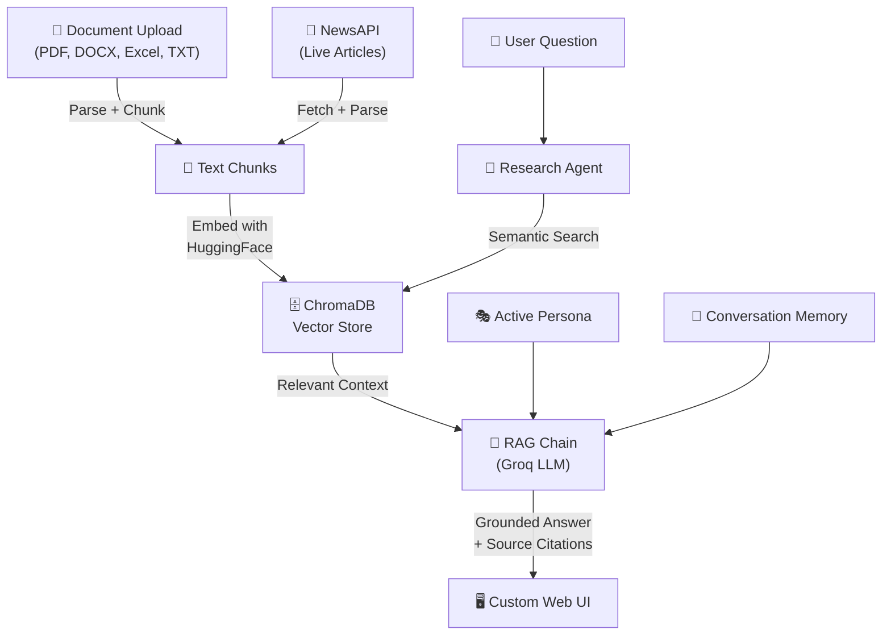

# 🧠 IntelliDigest — Multi-Source AI Research Assistant

A RAG-powered research assistant built with **LangChain**, **ChromaDB**, and **Groq (Llama 3.3)** that ingests documents, news articles, and more into a unified knowledge base — then lets you chat with it using persona-aware AI agents.


## Features

- **Multi-Format Document Ingestion** — Upload PDF, DOCX, Excel, and TXT files
- **Live News Search** — Fetch and ingest articles via NewsAPI
- **RAG Question Answering** — Retrieval-Augmented Generation with source citations
- **Semantic Search** — Find relevant content by meaning, not just keywords
- **5 Persona Modes** — Tone-adaptive responses (Tech, Business, Academic, Casual, Political)
- **Stuff & Map-Reduce Chains** — Brief and Detailed summarization
- **Conversation Memory** — Rolling summary compression for multi-turn context
- **Research Agent** — Intelligent tool routing based on query analysis
- **Custom Web UI** — Hand-crafted HTML/CSS/JS frontend with premium design system

## Architecture

```
IntelliDigest/
├── server.py                       # FastAPI REST API
├── frontend/
│   ├── index.html                  # App shell
│   ├── styles.css                  # Custom design system (DESIGN.md tokens)
│   └── app.js                      # All UI logic
├── agents/
│   └── research_agent.py           # ReAct-style agent with tool routing
├── chains/
│   ├── summarizer.py               # Stuff + Map-Reduce LangChain chains
│   └── qa_chain.py                 # RAG question-answering chain
├── ingestion/
│   ├── document_loader.py          # PDF, DOCX, Excel, TXT parser + chunking
│   └── news_retriever.py           # NewsAPI client
├── memory/
│   └── conversation.py             # Chat history + summary compression
├── vectorstore/
│   └── engine.py                   # ChromaDB + HuggingFace embeddings
├── personas/
│   └── personas.py                 # 5 persona definitions
├── .env.example                    # API key template
├── requirements.txt                # Python dependencies
└── README.md
```

### Data Flow



### API Endpoints

| Method | Endpoint | Description |
|---|---|---|
| `GET` | `/` | Serve the frontend |
| `GET` | `/api/personas` | List available personas |
| `GET` | `/api/stats` | Knowledge base statistics |
| `POST` | `/api/chat` | Send a message to the agent |
| `POST` | `/api/upload` | Upload a document |
| `POST` | `/api/news/search` | Search and ingest news |
| `GET` | `/api/search?q=...` | Semantic search |
| `DELETE` | `/api/clear` | Clear the knowledge base |
| `DELETE` | `/api/chat/clear` | Clear chat history |

### LangChain Components Used

| Component | Usage |
|---|---|
| `ChatGroq` | LLM interface (Llama 3.3 70B via Groq) |
| `ChatPromptTemplate` | Prompt engineering with persona injection |
| `HuggingFaceEmbeddings` | Local sentence-transformer embeddings |
| `Chroma` | Persistent vector store for semantic search |
| `StrOutputParser` | LCEL chain output parsing |
| LCEL Chains | `prompt \| llm \| parser` composition |
| Stuff Chain | Single-call brief summarization |
| Map-Reduce Chain | Multi-step detailed summarization |
| RAG Pattern | Retrieve → Augment → Generate with citations |
| Retriever | `vectorstore.as_retriever()` for RAG integration |

## Quick Start

The fastest and most reliable way to run IntelliDigest + n8n is via **Docker Compose**:

1. Clone the repository.
2. Form your `.env` file (see `.env.example`):

   ```bash
   cp .env.example .env
   ```

3. Run the complete stack:

   ```bash
   docker compose up -d --build
   ```

4. Open the web app at `http://localhost:8000`.

**For a detailed guide on how the AI agents, vector stores, and n8n bridge work under the hood, see [RUNNING_GUIDE.md](./RUNNING_GUIDE.md).**

## Tech Stack

- **Python 3.11+**
- **LangChain** — Chains, agents, prompts, memory
- **Groq** — Fast inference with Llama 3.3 70B
- **ChromaDB** — Persistent vector database
- **HuggingFace** — `all-MiniLM-L6-v2` sentence embeddings
- **FastAPI** — REST API framework
- **Vanilla HTML/CSS/JS** — Hand-crafted premium UI
- **NewsAPI** — Real-time news retrieval
