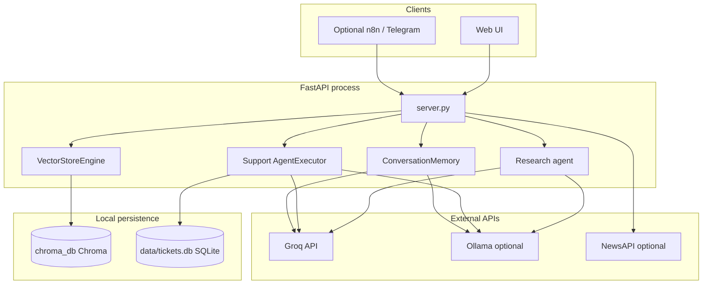
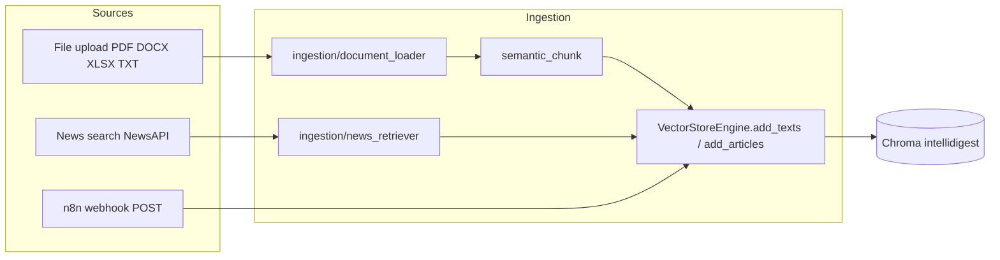
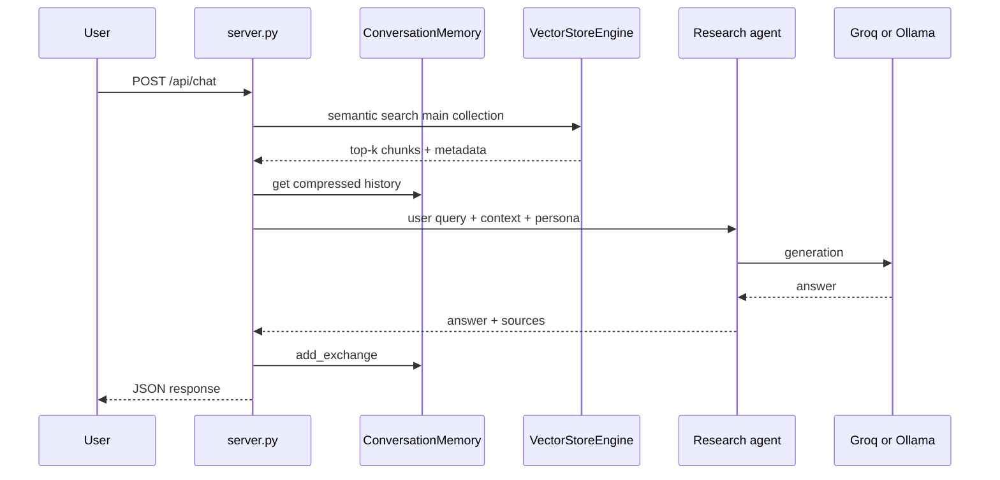
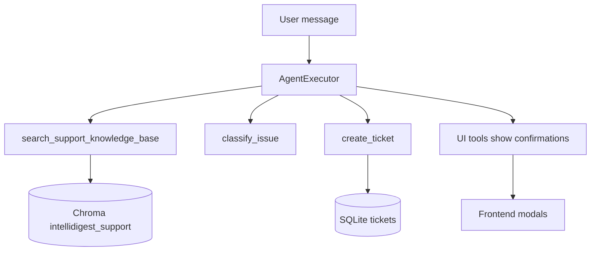

# IntelliDigest architecture

This document describes how the application is structured at runtime and how data flows through ingestion, retrieval, and the two conversational surfaces (research chat vs support).

For setup and deployment, see [README.md](../README.md), [RUNNING_GUIDE.md](RUNNING_GUIDE.md), and [PRODUCTION.md](PRODUCTION.md).

---

## 1. High-level system

IntelliDigest is a **FastAPI** backend (`server.py`) that serves a **static frontend** (`frontend/`) and initializes **LangChain**-based components on startup. A single process typically holds:

- **ChromaDB** (persistent `chroma_db/`) with **two collections** sharing one embedding model.
- **SQLite** (`data/tickets.db`) for support tickets.
- **Groq** as the primary LLM, with optional **Ollama** fallback (`chains/llm_factory.py`).

---

## 2. Dual knowledge bases (important split)

Embeddings use **HuggingFace** `sentence-transformers/all-MiniLM-L6-v2` (`vectorstore/engine.py`). Chroma stores:

| Collection | Purpose | Sources |
|------------|---------|---------|
| `intellidigest` | **Main** research KB | User uploads, news ingestion, n8n webhook ingest |
| `intellidigest_support` | **Support-only** KB | Curated `support/kb/*.md`, bootstrapped on first run if empty (`support/bootstrap_kb.py`) |

The **research** flow only searches the main collection. The **support** agent searches **only** `intellidigest_support` via `support/retriever.py`, so private uploads never leak into scripted support answers.

---

## 3. Startup lifecycle

On application lifespan (`server.py` → `lifespan`):

1. If `GROQ_API_KEY` is set: construct `VectorStoreEngine`, run support KB bootstrap, `ConversationMemory`, `create_research_agent(vectorstore)`, and `Summarizer`.
2. If the key is missing: components stay uninitialized; endpoints that need them should fail gracefully or warn.

There is **no** separate worker: ingestion and chat run in the same API process.

---

## 4. Dataflow: ingestion (into main KB)

Anything that adds text to the **main** collection follows: **raw content → chunk → embed → Chroma `intellidigest`**.

- **Uploads**: `load_document` + `semantic_chunk` → `add_texts`.
- **News**: `NewsRetriever` returns article dicts → `add_articles`.
- **n8n**: `POST /api/n8n/webhook` pushes external text into the same path the app uses for ingestion (see `server.py`).

---

## 5. Dataflow: research chat (main KB + memory)

The **Chat** tab uses the **research agent** (`agents/research_agent.py`): prompt-based orchestration (not `AgentExecutor`) that:

1. Retrieves similar chunks from the **main** vector store (`search_similar`).
2. Builds context + optional rolling history from `ConversationMemory` (summary compression in `memory/conversation.py`).
3. Calls the shared LLM stack (`make_groq_with_ollama_fallback`) with persona instructions (`personas/personas.py`).

A separate **QA chain** (`chains/qa_chain.py`) implements classic LCEL RAG (`retriever → prompt → LLM → parser`) and can be used where a strict RAG pipeline is preferred; the agent path is the primary “research” UX.

---

## 6. Dataflow: support tab (support KB + tickets)

The **Support** tab uses an **`AgentExecutor`** with tool-calling (`support/agent.py`):

- **Tools**: `search_support_knowledge_base` (support Chroma only), `classify_issue`, `create_ticket`, `get_ticket`, plus **UI affordance** tools (`support/ui_tools.py`) that do not mutate the DB—they signal the frontend to show confirm/edit/close dialogs.

Tickets are stored in **SQLite** (`support/tickets.py`). Closing/editing is mediated by REST (`PATCH`, `POST …/close`) or UI flows after confirmation—not by silent LLM writes.

---

## 7. Dataflow: optional n8n / Telegram

- **`POST /api/n8n/telegram`**: Server forwards payloads to a configured n8n webhook URL (Telegram automation); does not replace support/research logic.
- **`GET /api/n8n/status`**: Reflects whether a default webhook URL is configured.

See [n8n-telegram.md](n8n-telegram.md) for workflow setup.

---

## 8. Module map (where to read code)

| Area | Location | Role |
|------|----------|------|
| HTTP API | `server.py` | Routes, static files, wiring |
| Embeddings + Chroma | `vectorstore/engine.py` | Dual collections, search, add |
| Ingestion | `ingestion/` | Documents, news |
| Research UX | `agents/research_agent.py` | KB-grounded replies + sources |
| RAG chain | `chains/qa_chain.py` | LCEL RAG |
| Summaries | `chains/summarizer.py` | Stuff / map-reduce |
| LLM | `chains/llm_factory.py` | Groq + Ollama fallback |
| Chat memory | `memory/conversation.py` | Rolling summary |
| Support agent | `support/agent.py`, `support/retriever.py`, `support/tickets.py` | Tools + SQLite |
| Support KB seed | `support/bootstrap_kb.py`, `support/kb/*.md` | Support-only vectors |
| Personas | `personas/personas.py` | Tone presets |
| UI | `frontend/` | HTML/CSS/JS |

---

## 9. Operational notes

- **RAM**: Loading sentence-transformers and Chroma is memory-heavy; first cold start can be slow.
- **Single worker**: Typical when one process holds the embedding model; scale-out usually means multiple instances with shared volumes or external vector DB (out of scope for this repo’s default).

This architecture keeps **one main RAG corpus** for research and a **separate support corpus + ticket store** for customer-service workflows, all behind one FastAPI application.
